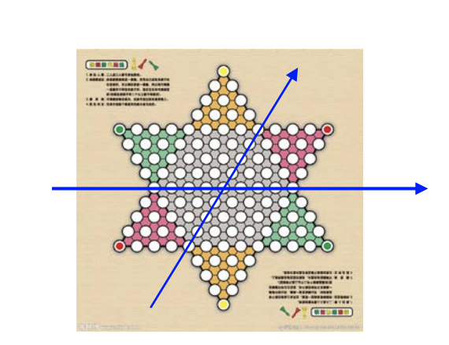

# nccu-2017-ai-java-project  [](https://travis-ci.org/mybaseball52/nccu-2017-ai-java-project)

政大 2017 人工智慧作業程式 - 有障礙的跳棋問題系列

## 作業說明
* 跳棋下棋的規則，排除鏡射的跳法
* 不可以使用非法的外部工具，例如存取其他跳棋程式
* 棋盤為一般的跳棋棋盤，見下圖
* 工作目標：可見測試檔



## 如何開始
以下的範例會指導如何在您的機器上運行本程式。

### Pre-Requisites
* Java 版本 - oracle-jdk 7 or oracle-jdk 8
* Maven 3.5.2 - 如果您使用 maven 進行程式建置的話
* Junit 4.12 - 執行測試

## 編譯
使用 Maven 進行編譯
```$xslt
mvn package
```

## 執行程式

如果使用外部測資，務必輸入副檔名，格式如下
```
java -cp locationof/packagename packagename.Main filename.txt Destination
```
其中 Destination 的地方僅支援輸入數字 
* 1 (設定左上方的綠色區域為終點)
* 2 (設定上方的黃色區域為終點) 以及 
* 3 (設定左下方的紅色區域為終點) 

#### Examples:

```$xslt
java -cp target/nccu-2017-ai-java-project.git-1.0-SNAPSHOT.jar homework.Main initial.txt 1
```
這個意思是使用檔案為 initial 的外部檔案作為輸入測資，並設定 1 的地區為終點

```$xslt
java -cp target/nccu-2017-ai-java-project.git-1.0-SNAPSHOT.jar homework.Main fixed 1

```
這個意思是固定下方黃色為起點，棋子填滿整個起點，並設定 1 的地區為終點

## 執行測試

```
mvn test -B
```

## 使用技術
* [Maven](https://maven.apache.org/) - Dependency Management
* [Travis.ci](https://travis-ci.org/mybaseball52/nccu-2017-ai-java-project) - CI server

## 作者